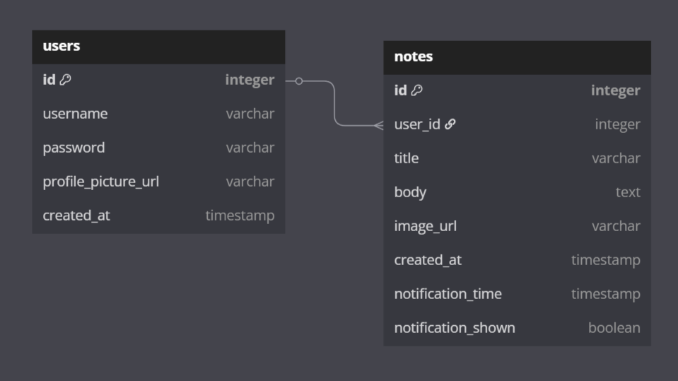

# Notez wizard

A simple and efficient note-taking application built with Java as the main programming language. The application allows users to create, edit, and manage their notes with a graphical interface developed using JavaFX.

---

### Features
- Create, edit, and delete notes
- Search notes with keywords
- Persistent storage using MariaDB
- FXML-based UI design
- Follows the MVC (model-view-Controller) pattern

### Programming Languages, Technologies, and Tools Used
- **Java**
- **JavaFX**
- **CSS**
- **Maven**
- **Hibernate**
- **JPA**
- **MariaDB**
- **ImgBB**
- **Jenkins**
- **Docker**

---

## Installation

### Prerequisites
Ensure you have the following installed:
- Git
- Java (JDK 21)
- Maven
- MariaDB Server

### Setup Steps
1. **Clone the repository**
   ```sh
   git clone https://github.com/marikraa/Ohjelmistotuotantoprojekti.git
   cd Ohjelmistotuotantoprojekti
   ```

2. **Build the project using Maven**
   ```sh
   mvn clean install
   ```

3. **Run the database creation script**
   ```
    ├── src/main/java/
    │   ├── datasource
    │   │   ├── sql_script.sql
   ```

4. **Download the font**
- Find the following ttf-file from your files, right-click on it, and select _Install_

    ```
     ├── src/main/resources/
     │   ├── fonts
     │   │   ├── MadimiOne-Regular.ttf
    ```

5. **Run the application from main**

   ```
    ├── src/main/java/
    │   ├── view
    │   │   ├── Main.java
   ```

---

## Entity-Relationship Diagram of the Database



---

## Contributors
- [Maria Aalto](https://github.com/marikraa)
- [Suphitcha Pitkänen](https://github.com/liukkari)
- [Ville Schulz](https://github.com/VilleSchulz)